# Building and Installing

## Modularization

```mermaid
flowchart LR
    app(":app")
    basic(":basic")
    jvm_basic(":jvm-basic")

    subgraph core[":core"]
        core_activity_actions(":core:activity-actions")
        core_alterable_adaptive_icon(":core:alterable-adaptive-icon")
        core_composable(":core:composable")
        core_custom_tab_browser(":core:custom-tab-browser")
        core_icons(":core:icons")
        core_local_provider(":core:local-provider")
        core_navigation(":core:navigation")
        core_resources(":core:resources")
        core_settings(":core:settings")
        core_shortcut(":core:shortcut")
        core_theme(":core:theme")
    end

    subgraph feature[":feature"]
        feature_analog_clock_widget(":feature:analog-clock-widget")
        feature_cat_editor(":feature:cat-editor")
        feature_crash(":feature:crash")
        feature_embedding_splits(":feature:embedding-splits")
        feature_libraries_info(":feature:libraries-info")
        feature_neko_controls_widget(":feature:neko-controls-widget")
    end

    subgraph eggs[":eggs"]
        eggs_base(":eggs:Base")
        eggs_gingerbread(":eggs:Gingerbread")
        eggs_honeycomb(":eggs:Honeycomb")
        eggs_ice_cream_sandwich(":eggs:IceCreamSandwich")
        eggs_jelly_bean(":eggs:JellyBean")
        eggs_kitkat(":eggs:KitKat")
        eggs_lollipop(":eggs:Lollipop")
        eggs_marshmallow(":eggs:Marshmallow")
        eggs_nougat(":eggs:Nougat")
        eggs_oreo(":eggs:Oreo")
        eggs_pie(":eggs:Pie")
        eggs_q(":eggs:Q")
        eggs_r(":eggs:R")
        eggs_s(":eggs:S")
        eggs_tiramisu(":eggs:Tiramisu")
        eggs_upside_down_cake(":eggs:UpsideDownCake")
        eggs_vanilla_ice_cream(":eggs:VanillaIceCream")
        eggs_baklava(":eggs:Baklava")
        eggs_cinnamon_bun(":eggs:CinnamonBun")
        eggs_android_next(":eggs:AndroidNext")
        eggs_rocket_launcher(":eggs:RocketLauncher")
    end

    subgraph script[":script"]
        script_compose_material_icons_generator(":script:compose-material-icons-generator")
        script_emoji_svg_xml_convertor(":script:emoji-svg-xml-convertor")
    end

    classDef appModule fill:#ffebee,stroke:#ff1744,color:#ff1744,rx:8,ry:8
    classDef baseModule fill:#f9fafb,stroke:#6b7280,color:#6b7280,rx:8,ry:8
    classDef coreModule fill:#eff6ff,stroke:#2f80ed,color:#2f80ed,rx:8,ry:8
    classDef featureModule fill:#f0fdf4,stroke:#27ae60,color:#27ae60,rx:8,ry:8
    classDef eggsModule fill:#fff7ed,stroke:#f2994a,color:#f2994a,rx:8,ry:8
    classDef scriptModule fill:#faf5ff,stroke:#9b51e0,color:#9b51e0,rx:8,ry:8

    class app appModule
    class basic,jvm_basic baseModule
    class core_activity_actions,core_alterable_adaptive_icon,core_composable,core_custom_tab_browser,core_icons,core_local_provider,core_navigation,core_resources,core_settings,core_shortcut,core_theme coreModule
    class feature_analog_clock_widget,feature_cat_editor,feature_crash,feature_embedding_splits,feature_libraries_info,feature_neko_controls_widget featureModule
    class eggs_base,eggs_gingerbread,eggs_honeycomb,eggs_ice_cream_sandwich,eggs_jelly_bean,eggs_kitkat,eggs_lollipop,eggs_marshmallow,eggs_nougat,eggs_oreo,eggs_pie,eggs_q,eggs_r,eggs_s,eggs_tiramisu,eggs_upside_down_cake,eggs_vanilla_ice_cream,eggs_baklava,eggs_cinnamon_bun,eggs_android_next,eggs_rocket_launcher eggsModule
    class script_compose_material_icons_generator,script_emoji_svg_xml_convertor scriptModule

    style core fill:#f8fbff,stroke:#2f80ed,color:#2f80ed,rx:8,ry:8
    style feature fill:#f8fffa,stroke:#27ae60,color:#27ae60,rx:8,ry:8
    style eggs fill:#fffaf4,stroke:#f2994a,color:#f2994a,rx:8,ry:8
    style script fill:#fdfaff,stroke:#9b51e0,color:#9b51e0,rx:8,ry:8

    app --> core_local_provider
    app --> core_navigation
    app --> core_theme
    app --> core_icons
    app --> core_settings
    app --> core_composable
    app --> core_shortcut
    app --> core_activity_actions
    app --> core_resources
    app --> core_alterable_adaptive_icon
    app --> core_custom_tab_browser
    app --> feature_cat_editor
    app --> feature_analog_clock_widget
    app --> feature_neko_controls_widget
    app --> feature_crash
    app --> feature_embedding_splits
    app --> feature_libraries_info
    app --> eggs_rocket_launcher
    app --> eggs_cinnamon_bun
    app --> eggs_baklava
    app --> eggs_vanilla_ice_cream
    app --> eggs_upside_down_cake
    app --> eggs_tiramisu
    app --> eggs_s
    app --> eggs_r
    app --> eggs_q
    app --> eggs_pie
    app --> eggs_oreo
    app --> eggs_nougat
    app --> eggs_marshmallow
    app --> eggs_lollipop
    app --> eggs_kitkat
    app --> eggs_jelly_bean
    app --> eggs_ice_cream_sandwich
    app --> eggs_honeycomb
    app --> eggs_gingerbread
    app --> eggs_base

    core_activity_actions --> core_composable
    core_activity_actions --> core_resources
    core_activity_actions --> core_shortcut
    core_activity_actions --> eggs_baklava
    core_activity_actions --> eggs_tiramisu
    core_activity_actions --> eggs_s
    core_activity_actions --> eggs_r
    core_activity_actions --> eggs_oreo
    core_activity_actions --> eggs_nougat
    core_activity_actions --> eggs_marshmallow
    core_activity_actions --> eggs_lollipop
    core_activity_actions --> eggs_kitkat
    core_activity_actions --> eggs_jelly_bean
    core_activity_actions --> eggs_ice_cream_sandwich
    core_alterable_adaptive_icon --> core_settings
    core_composable --> basic
    core_composable --> core_theme
    core_composable --> core_settings
    core_custom_tab_browser --> core_theme
    core_local_provider --> core_custom_tab_browser
    core_navigation --> core_local_provider
    core_settings --> core_theme
    core_shortcut --> core_alterable_adaptive_icon
    core_shortcut --> core_resources

    feature_analog_clock_widget --> core_theme
    feature_analog_clock_widget --> core_resources
    feature_analog_clock_widget --> core_settings
    feature_analog_clock_widget --> core_icons
    feature_cat_editor --> core_theme
    feature_cat_editor --> core_resources
    feature_cat_editor --> core_local_provider
    feature_cat_editor --> core_navigation
    feature_cat_editor --> core_icons
    feature_cat_editor --> core_settings
    feature_crash --> core_theme
    feature_embedding_splits --> core_theme
    feature_embedding_splits --> core_settings
    feature_libraries_info --> core_theme
    feature_libraries_info --> core_resources
    feature_libraries_info --> core_navigation
    feature_libraries_info --> core_custom_tab_browser
    feature_neko_controls_widget --> core_theme
    feature_neko_controls_widget --> core_settings

    eggs_android_next --> core_custom_tab_browser
    eggs_android_next --> core_navigation
    eggs_android_next --> core_alterable_adaptive_icon
    eggs_android_next --> core_settings
    eggs_rocket_launcher --> core_resources
    eggs_rocket_launcher --> core_composable
    eggs_tiramisu --> jvm_basic
    script_emoji_svg_xml_convertor --> jvm_basic

    linkStyle 0,1,2,3,4,5,6,7,8,9,10 stroke:#2f80ed,stroke-width:2px
    linkStyle 11,12,13,14,15,16 stroke:#27ae60,stroke-width:2px
    linkStyle 17,18,19,20,21,22,23,24,25,26,27,28,29,30,31,32,33,34,35,36 stroke:#f2994a,stroke-width:2px
    linkStyle 37,38,39,40,41,42,43,44,45,46,47,48,49,50,51,52,53,54,55,56,57,58,59,60 stroke:#2f80ed,stroke-width:2px
    linkStyle 61,62,63,64,65,66,67,68,69,70,71,72,73,74,75,76,77,78,79 stroke:#27ae60,stroke-width:2px
    linkStyle 80,81,82,83,84,85,86 stroke:#f2994a,stroke-width:2px
    linkStyle 87 stroke:#9b51e0,stroke-width:2px
```



## Requested

* Java 17
* Android SDK

Specify your Android SDK path either using the `ANDROID_HOME` environment variable, or by filling out the `sdk.dir` property in `local.properties`.

Signing can be done automatically using `key.properties` as follows:

```properties
storeFile=path/to/keystore.jks
storePassword=store-password
keyAlias=key-alias
keyPassword=key-password
```

## Build

Run `./gradlew app:assembleFossProductRelease` to build the package, which can be installed using the Android package manager.
