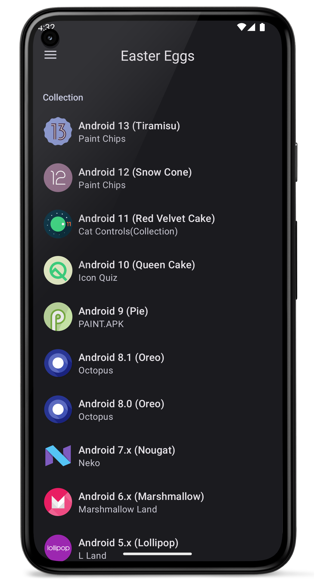
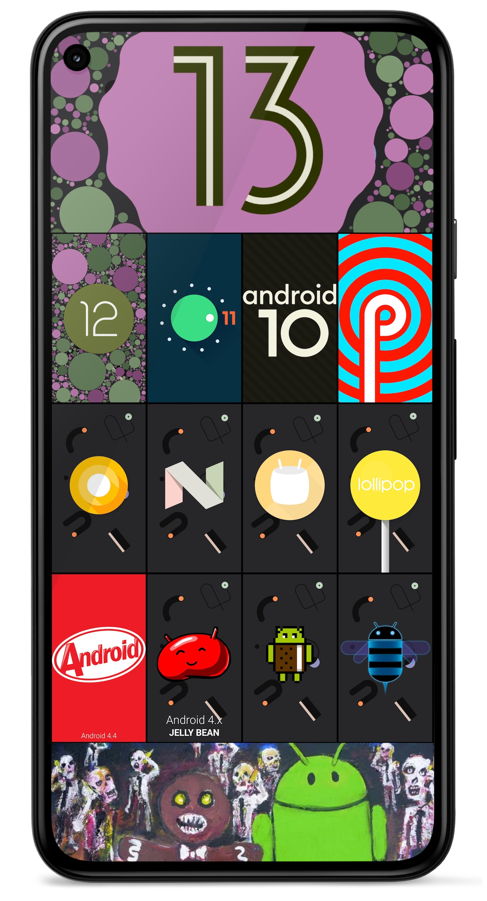

# Android Easter Eggs

整理了Android系统各正式版的彩蛋

 
 [](https://github.com/hushenghao/AndroidEasterEggs/blob/master/LICENSE) [](https://github.com/hushenghao/AndroidEasterEggs/releases)


**下载安装**

[](https://play.google.com/store/apps/details?id=com.dede.android_eggs) 
[](https://www.coolapk.com/apk/com.dede.android_eggs) [](https://www.pgyer.com/eggs)

项目包含了系统彩蛋完整代码，旨在对系统彩蛋的整理和兼容，以保证大多数设备可以体验到不同版本的彩蛋，不会对系统彩蛋代码做过多修改。部分版本使用了系统新特性，低版本只能使用部分功能。

[English](./README.md)

## 截图
 

## 版本明细
| 名称                                 |  SDK  | 彩蛋                            | 状态  | 有使用新特性 [*](#id_new_features) | 最小版本 [*](#id_full_egg_mini_sdk) |
|------------------------------------|:-----:|-------------------------------|:---:|:----------------------------:|:-------------------------------:|
| Android 14 (Upside Down Cake)      |       |                               | ⌛️  |                              |                                 |
| Android 13 (Tiramisu)              |  33   | Paint Chips                   |  ✅  |              ✅               | 31 [*](#id_color_vector_fonts)  |
| Android 12 (Snow Cone)             | 31~32 | Paint Chips                   |  ✅  |              ✅               |               31                |
| Android 11 (Red Velvet Cake)       |  30   | Cat Controls(Collection)      |  ✅  |              ✅               |               30                |
| Android 10 (Queen Cake)            |  29   | Icon Quiz                     |  ✅  |              ❌               |                -                |
| Android 9 (Pie)                    |  28   | PAINT.APK                     |  ✅  |              ❌               |                -                |
| Android 8.x (Oreo)                 | 26~27 | Octopus                       |  ✅  |              ❌               |                -                |
| Android 7.x (Nougat)               | 24~25 | Neko                          |  ✅  |              ✅               |               24                |
| Android 6.x (Marshmallow)          |  23   | Marshmallow Land              |  ✅  |              ❌               |                -                |
| Android 5.x (Lollipop)             | 21~22 | L Land                        |  ✅  |              ❌               |                -                |
| Android 4.4 (KitKat)               | 19~20 | Dessert Case                  |  ✅  |              ❌               |                -                |
| Android 4.x (Jelly Bean)           | 16~18 | BeanBag                       |  ✅  |              ❌               |                -                |
| Android 4.0.x (Ice Cream Sandwich) | 14~15 | Nyandroid                     |  ✅  |              ❌               |                -                |
| Android 3.x (Honeycomb)            | 11~13 | Honeycomb [*](#id_egg_name)   |  ✅  |              ❌               |                -                |
| Android 2.3.x (Gingerbread)        | 9~10  | Gingerbread [*](#id_egg_name) |  ✅  |              ❌               |                -                |
| Android 2.2 (Froyo)                |   8   | -                             |  -  |              -               |                -                |
| Android 2.x (Eclair)               |  5~7  | -                             |  -  |              -               |                -                |
| Android 1.6 (Donut)                |   4   | -                             |  -  |              -               |                -                |
| Android 1.5 (Cupcake)              |   3   | -                             |  -  |              -               |                -                |
| Android 1.x (Base)                 |  1~2  | -                             |  -  |              -               |                -                |

* <span id='id_new_features'>使用了系统新特性的彩蛋，老版本系统只能使用部分功能。</span>
* <span id='id_full_egg_mini_sdk'>完整体验彩蛋所需要的最低SDK版本。</span>
* <span id='id_color_vector_fonts'>[Android 13](https://developer.android.google.cn/about/versions/13/features#color-vector-fonts) 可支持呈现 [COLRv1](https://developer.chrome.com/blog/colrv1-fonts/) 字体，并将系统表情符号更新成了 COLRv1 格式。</span>
* <span id='id_egg_name'>老版本的彩蛋没有具体命名，这里使用系统版本别名。</span>

## 测试

使用Android设备或者模拟器.
```shell
./gradlew app:cAT
```

由Android Gradle插件管理的模拟器的设备类型。

```shell
./gradlew app:pixel4Api33DebugAndroidTest
```

## 其他

如果存在错误和问题，欢迎提交 [Issues](https://github.com/hushenghao/AndroidEasterEggs/issues) 。如果你对本项目感兴趣，欢迎提交 [Pull requests](https://github.com/hushenghao/AndroidEasterEggs/pulls) 参与。

[系统源码](https://github.com/aosp-mirror/platform_frameworks_base)

[联系我](mailto:dede.hu@qq.com)
