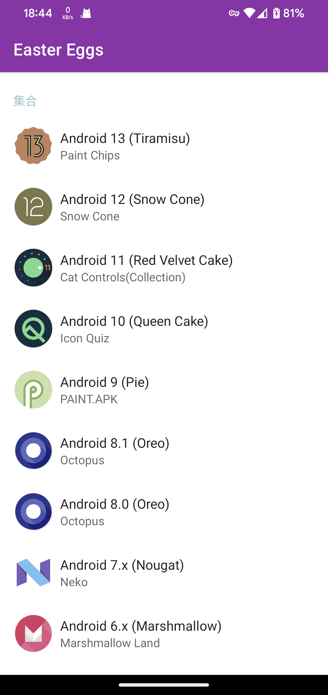

# Android Easter Eggs

整理了Android系统各正式版的彩蛋

[下载](https://www.pgyer.com/eggs)

项目包含了系统彩蛋完整代码，旨在对系统彩蛋的整理和兼容，以保证大多数设备可以体验到不同版本的彩蛋，不会对系统彩蛋代码做过多修改。部分版本使用了系统新特性，低版本只能使用部分功能。

## 详细细节
| 名称 | SDK | 彩蛋 | 状态 | 有使用新特性 [*](#id_new_features) | 最小版本 [*](#id_full_egg_mini_sdk) |
|---|:---:|---|:---:|:---:|:---:|
| Android U |  |  | ⌛️ |  |  |
| Android 13 (Tiramisu) | 33 | Paint Chips | ✅ | ✅ | 31 |
| Android 12 (Snow Cone) | 31~32 | Paint Chips | ✅ | ✅ | 31 |
| Android 11 (Red Velvet Cake) | 30 | Cat Controls(Collection) | ✅ | ✅ | 30 |
| Android 10 (Queen Cake) | 29 | Icon Quiz | ✅ | ❌ | - |
| Android 9 (Pie) | 28 | PAINT.APK | ✅ | ❌ | - |
| Android 8.x (Oreo) | 26~27 | Octopus | ✅ | ❌ | - |
| Android 7.x (Nougat) | 24~25 | Neko | ✅ | ✅ | 24 |
| Android 6.x (Marshmallow) | 23 | Marshmallow Land | ✅ | ❌ | - |
| Android 5.x (Lollipop) | 21~22 | L Land | ✅ | ❌ | - |
| Android 4.4 (KitKat) | 19~20 | Dessert Case | ✅ | ❌ | - |
| Android 4.x (Jelly Bean) | 16~18 | BeanBag | ✅ | ❌ | - |
| Android 4.0.x (Ice Cream Sandwich) | 14~15 | Nyandroid | ✅ | ❌ | - |
| Android 3.x (Honeycomb) | 11~13 | Honeycomb [*](#id_egg_name) | ✅ | ❌ | - |
| Android 2.3.x (Gingerbread) | 9~10 | Gingerbread [*](#id_egg_name) | ✅ | ❌ | - |
| Android 2.2 (Froyo) | 8 | - | - | - | - |
| Android 2.x (Eclair) | 5~7 | - | - | - | - |
| Android 1.6 (Donut) | 4 | - | - | - | - |
| Android 1.5 (Cupcake) | 3 | - | - | - | - |
| Android 1.x (Base) | 1~2 | - | - | - | - |

* 使用了系统新特性的彩蛋，老版本系统只能使用部分功能。
* 完整体验彩蛋所需要的最低SDK版本。
* 老版本的彩蛋没有具体命名，这里使用系统版本别名。

## 截图

## 其他

如果存在错误和问题，欢迎提交 [Issues](https://github.com/hushenghao/AndroidEasterEggs/issues) 。如果你对本项目感兴趣，欢迎提交 [Pull requests](https://github.com/hushenghao/AndroidEasterEggs/pulls) 参与。

[系统源码](https://github.com/aosp-mirror/platform_frameworks_base)
