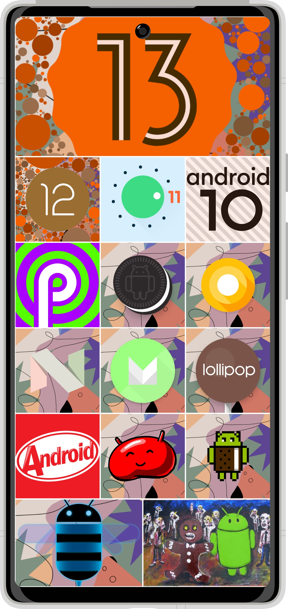
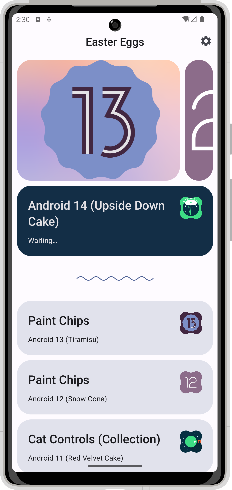
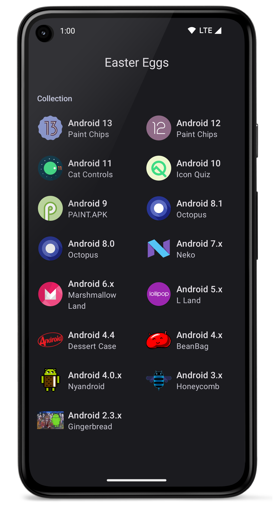
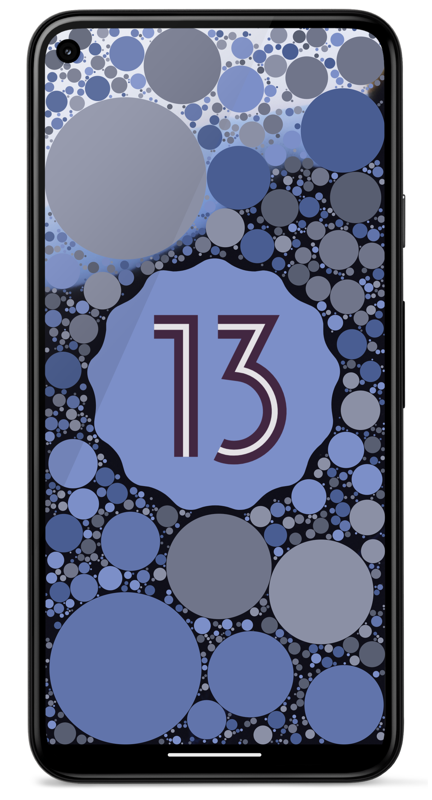
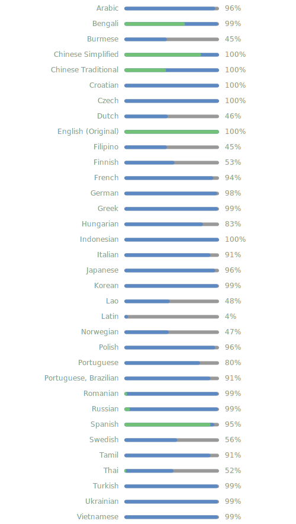

# Android Easter Eggs

整理了Android系统各正式版的彩蛋


[](https://github.com/hushenghao/AndroidEasterEggs/blob/master/LICENSE)
[](https://crowdin.com/project/easter-eggs)
[](https://github.com/hushenghao/AndroidEasterEggs/actions/workflows/buildRelease.yml)
[](https://github.com/hushenghao/AndroidEasterEggs/releases)
[](https://f-droid.org/packages/com.dede.android_eggs)

<div align="center">


**[English](./README.md) • [中文](./README_zh.md)**

</div>

项目包含了系统彩蛋完整代码，旨在对系统彩蛋的整理和兼容，以保证大多数设备可以体验到不同版本的彩蛋，不会对系统彩蛋代码做过多修改。部分版本使用了系统新特性，低版本只能使用部分功能。

## 下载

| [](https://f-droid.org/packages/com.dede.android_eggs) | [](https://play.google.com/store/apps/details?id=com.dede.android_eggs&utm_source=Github&pcampaignid=pcampaignidMKT-Other-global-all-co-prtnr-py-PartBadge-Mar2515-1) | [](https://www.coolapk.com/apk/com.dede.android_eggs) | [](https://www.pgyer.com/eggs) |
|--------------------------------------------------------------------------------------------------------------------------------------|---------------------------------------------------------------------------------------------------------------------------------------------------------------------------------------------------------------------------------------------|------------------------------------------------------------------------------------------------------------|---------------------------------------------------------------------|

* **Google Play** 使用 [Play 应用签名功能](https://support.google.com/googleplay/android-developer/answer/9842756)，可能出现无法和其他下载渠道互相升级的问题。
* **蒲公英** 下载的是Beta版本，可能包含了一些尚未稳定的新功能。

## 截图

|  |  |  |  |
|----------------------------------------------------------------------|----------------------------------------------------------------------|----------------------------------------------------------------------|----------------------------------------------------------------------|

## Android 版本
| 名称                                     | API level | 彩蛋                            | 使用了新特性 [*](#id_new_features) | 最低 API [*](#id_full_egg_mini_api) |
|----------------------------------------|:---------:|-------------------------------|:----------------------------:|:---------------------------------:|
| Android 14 (Upside Down Cake)          |    34     | ⌛️                            |                              |                                   |
| Android 13 (Tiramisu)                  |    33     | Paint Chips                   |              ✅               |       31 [*](#id_android12)       |
| Android 12 (Snow Cone)                 |   31-32   | Paint Chips                   |              ✅               |       31 [*](#id_android12)       |
| Android 11 (Red Velvet Cake)           |    30     | Cat Controls(Collection)      |              ✅               |       30 [*](#id_android11)       |
| Android 10 (Queen Cake)                |    29     | Icon Quiz                     |              🚫              |                 -                 |
| Android 9 (Pie)                        |    28     | PAINT.APK                     |              🚫              |                 -                 |
| Android 8.0-8.1 (Oreo)                 |   26-27   | Octopus                       |              🚫              |                 -                 |
| Android 7.0-7.1 (Nougat)               |   24-25   | Neko                          |              ✅               |       24 [*](#id_android7)        |
| Android 6.0 (Marshmallow)              |    23     | Marshmallow Land              |              🚫              |                 -                 |
| Android 5.0-5.1 (Lollipop)             |   21-22   | L Land                        |              🚫              |                 -                 |
| Android 4.4-4.4W (KitKat)              |   19-20   | Dessert Case                  |              🚫              |                 -                 |
| Android 4.1-4.3 (Jelly Bean)           |   16-18   | BeanBag                       |              🚫              |                 -                 |
| Android 4.0-4.0.3 (Ice Cream Sandwich) |   14-15   | Nyandroid                     |              🚫              |                 -                 |
| Android 3.0-3.2 (Honeycomb)            |   11-13   | Honeycomb [*](#id_egg_name)   |              🚫              |                 -                 |
| Android 2.3-2.3.3 (Gingerbread)        |   9-10    | Gingerbread [*](#id_egg_name) |              🚫              |                 -                 |
| Android 2.2 (Froyo)                    |     8     | -                             |              -               |                 -                 |
| Android 2.0-2.1 (Eclair)               |    5-7    | -                             |              -               |                 -                 |
| Android 1.6 (Donut)                    |     4     | -                             |              -               |                 -                 |
| Android 1.5 (Cupcake)                  |     3     | -                             |              -               |                 -                 |
| Android 1.1 (Petit Four)               |     2     | -                             |              -               |                 -                 |
| Android 1.0 (Base)                     |     1     | -                             |              -               |                 -                 |

* <span id='id_new_features'>使用了系统新特性的彩蛋，老版本系统只能使用部分功能。</span>
* <span id='id_full_egg_mini_api'>完整体验彩蛋所需要的最低API版本。</span>
* <span id='id_android12'>Android 12 (API level 31) 改进了现有的 [Widgets API](https://developer.android.google.cn/about/versions/12/features/widgets?hl=zh-cn)，以改善平台和启动器中的用户和开发者体验。</span>
* <span id='id_android11'>在 Android 11 (API level 30) 及更高版本中，[快速访问设备控制器](https://developer.android.google.cn/guide/topics/ui/device-control?hl=zh-cn) 功能可让用户通过 Android 电源菜单快速查看和控制外部设备。</span>
* <span id='id_android7'>在 Android 7 (API level 24) 中，扩展了 [快速设置](https://developer.android.google.cn/about/versions/nougat/android-7.0?hl=zh-cn#tile_api) 的范围，使其更加有用而且更方便。</span>
* <span id='id_egg_name'>老版本的彩蛋没有具体命名，这里使用系统版本别名。</span>

## 贡献

请查看我们的[贡献文档](.github/CONTRIBUTING.md)来报告问题，或参与应用程序和文档的[翻译](https://zh.crowdin.com/project/easter-eggs)。

<details>
<summary>查看所有语言的翻译状态。</summary>

[](https://zh.crowdin.com/project/easter-eggs)

</details>

## 编译

前提是已安装了 `Java17` 和 `Android SDK`，并配置了对应环境变量。

```shell
./gradlew assembleRelease
```

Windows 需要使用 `gradlew.bat`： 

```shell
gradlew.bat assembleRelease
```

## 测试

使用Android设备或者模拟器.
```shell
./gradlew app:cAT
```

由Android Gradle插件管理的模拟器的设备类型。

```shell
./gradlew app:pixel4Api33DebugAndroidTest
```

## 其他

[隐私协议](https://github.com/hushenghao/AndroidEasterEggs/wiki/Privacy-policy-zh-CN)

[联系我 📧](mailto:dede.hu@qq.com)

### 感谢
[AOSP Frameworks](https://github.com/aosp-mirror/platform_frameworks_base)

[🦖 T-Rex Run 3D](https://github.com/Priler/dino3d)
