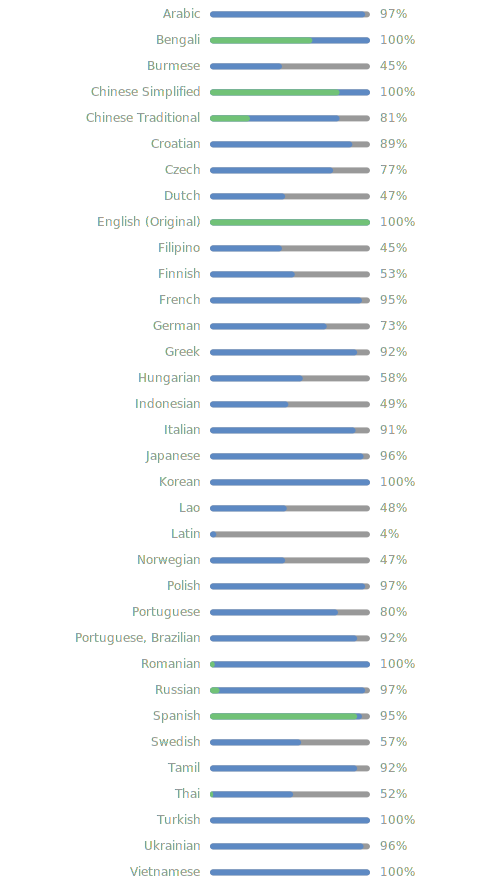

# Android Easter Egg Collections

收集了Android系统各正式版的彩蛋


[](https://github.com/hushenghao/AndroidEasterEggs/blob/master/LICENSE)
[](https://github.com/hushenghao/AndroidEasterEggs/releases)
[](https://f-droid.org/packages/com.dede.android_eggs)
[](https://crowdin.com/project/easter-eggs)
[](https://github.com/hushenghao/AndroidEasterEggs/actions/workflows/buildBeta.yml)

<div align="center">


**[English](./README.md) • [中文](./README_zh.md)**

</div>

项目包含了系统彩蛋完整代码，旨在对系统彩蛋的整理和兼容，以保证大多数设备可以体验到不同版本的彩蛋，不会对系统彩蛋代码做过多修改。

## 下载

| [](https://f-droid.org/packages/com.dede.android_eggs) | [](https://play.google.com/store/apps/details?id=com.dede.android_eggs&utm_source=Github&pcampaignid=pcampaignidMKT-Other-global-all-co-prtnr-py-PartBadge-Mar2515-1) | [](https://github.com/hushenghao/AndroidEasterEggs/releases) | [](https://www.pgyer.com/eggs) |
|--------------------------------------------------------------------------------------------------------------------------------------|---------------------------------------------------------------------------------------------------------------------------------------------------------------------------------------------------------------------------------------------|------------------------------------------------------------------------------------------------------|---------------------------------------------------------------------|

* **Google Play**
  使用 [Play 应用签名功能](https://support.google.com/googleplay/android-developer/answer/9842756)
  ，可能出现无法和其他下载渠道互相升级的问题。
* **蒲公英** 下载的是Beta版本，可能包含了一些尚未稳定的新功能。

## 截图

|  |  |  |  |
|--------------------------------------------------------------------------------|--------------------------------------------------------------------------------|--------------------------------------------------------------------------------|--------------------------------------------------------------------------------|

## 贡献

请查看我们的[贡献文档](.github/CONTRIBUTING.md)
来报告问题，或参与应用程序和文档的[翻译](https://zh.crowdin.com/project/easter-eggs)。

<details>
<summary>查看所有语言的翻译状态。</summary>

[](https://zh.crowdin.com/project/easter-eggs)

</details>

## 感谢

* [AOSP](https://cs.android.com/android/platform/superproject/main)
* [所有翻译贡献者](https://zh.crowdin.com/project/easter-eggs/members)

## 协议

```text
Copyright 2024 Hu Shenghao

Licensed under the Apache License, Version 2.0 (the "License");
you may not use this file except in compliance with the License.
You may obtain a copy of the License at

    http://www.apache.org/licenses/LICENSE-2.0

Unless required by applicable law or agreed to in writing, software
distributed under the License is distributed on an "AS IS" BASIS,
WITHOUT WARRANTIES OR CONDITIONS OF ANY KIND, either express or implied.
See the License for the specific language governing permissions and
limitations under the License.
```
