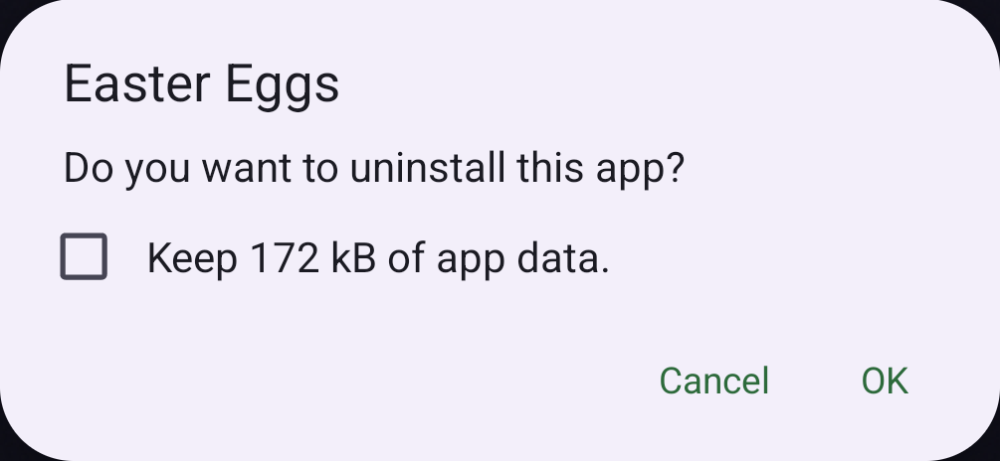
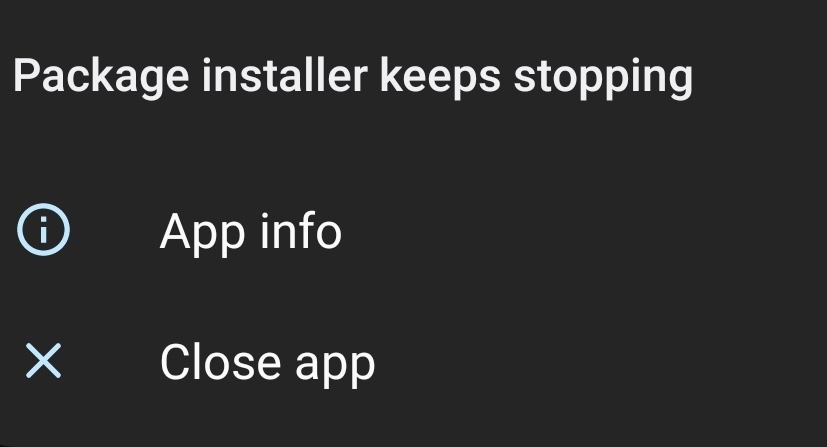

# Uninstall Easter Eggs (Deprecated)

**Before v1.9.6**, Easter Eggs is configured `android:hasFragileUserData="true"` on manifest.

[`android:hasFragileUserData`](https://developer.android.com/guide/topics/manifest/application-element#fragileuserdata)
```
Whether to show the user a prompt to keep the app's data when the user uninstalls the app. 
```



But it may cause the Package installer process of some devices to crash when uninstalling `Easter Eggs`.



## How to Uninstall (Recommended)

This method may not work for users who install through GooglePlay, as different apk signatures cannot override the installation.

1. Download [`Easter Eggs latest version`](https://github.com/hushenghao/AndroidEasterEggs/releases);
2. Install the Apk, the 'android:hasFragileUserData='true' configuration has been removed from the latest version;
3. Uninstall `Easter Eggs`.

## Use adb Uninstall

If you do not know what `adb` is, this method is not recommended because of the risk of misoperation.

```shell
adb uninstall com.dede.android_eggs
```