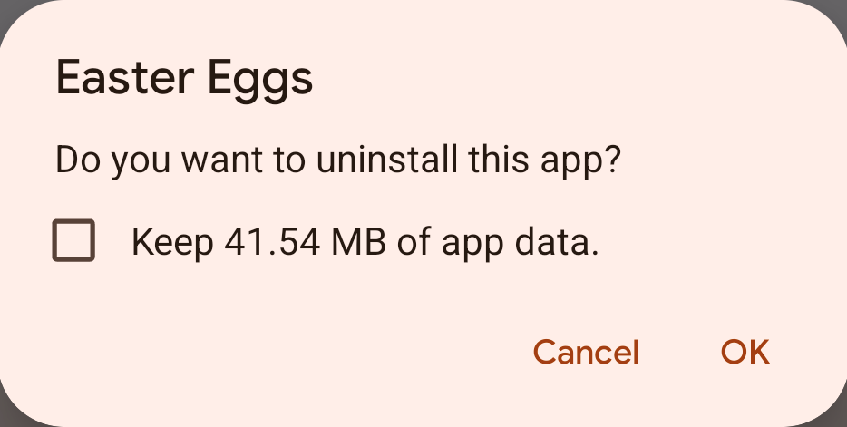

# Uninstall Easter Eggs

Easter Eggs is configured `android:hasFragileUserData="true"` on manifest.

[`android:hasFragileUserData`](https://developer.android.com/guide/topics/manifest/application-element#fragileuserdata)
```
Whether to show the user a prompt to keep the app's data when the user uninstalls the app. 
```



But it may cause the Package installer process of some devices to crash when uninstalling `Easter Eggs`.


## How to Uninstall (Recommended)

This method may not work for users who install through GooglePlay, as different apk signatures cannot override the installation.

1. Download [`Uninstall Easter Eggs.apk`](uninstall_easter_eggs_9.9.9_10000-release.apk), The file name
   is: `uninstall_easter_eggs_xxx.apk`;
2. Install the Apk, which has the same package name as the `Easter Eggs`, so it can cover the Easter
   Eggs;
3. Uninstall the `Uninstall Easter Eggs` directly to uninstall Easter Eggs.
4. Done.

## Use adb Uninstall

If you do not know what `adb` is, this method is not recommended because of the risk of misoperation.

```shell
adb uninstall com.dede.android_eggs
```